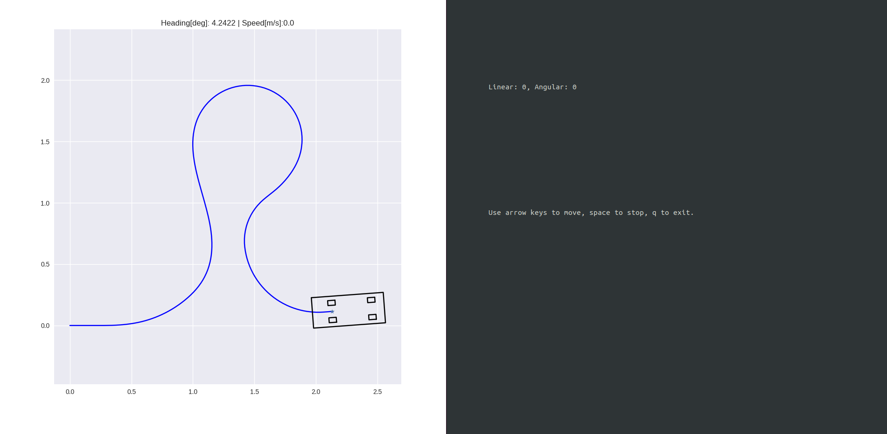
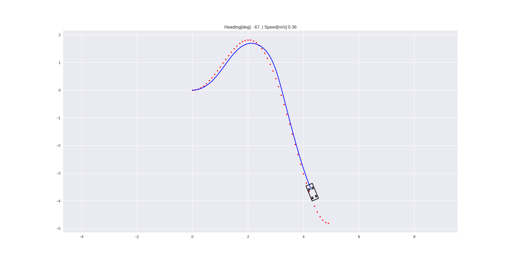
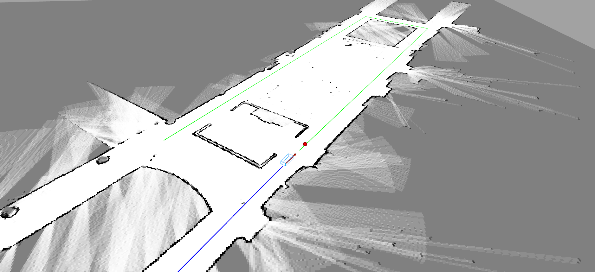

# Internal SVEA Research Codebase

### Quicklinks:
- [SVEA website](https://svea.eecs.kth.se)
- [Tutorials](https://github.com/KTH-SML/svea_research/tree/main/docs/tutorials)
- [Sim to Real Tips](https://github.com/KTH-SML/svea_research#going-from-simulation-to-real)
- [Testing](https://github.com/KTH-SML/svea_research#testing)

## A short description
This repo contains a basic library of python objects and scripts to make
development on the Small-Vehicles-for-Autonomy (SVEA) platform simpler
and cleaner.

The design principle of this library is to help create projects that are
more modular and easier to troubleshoot. As opposed to the standard
approach of creating a large web of Subscriber/Publisher nodes, we modularly
wrap different ROS entities in Python objects, while exposing only the useful
features with object-oriented interfaces.

## Useful to know before starting
Before continuing to the next sections, consider taking some time to read up on
two important concepts for this code base: the **Robotic Operating System (ROS)**
and **Object Oriented Programming (OOP)**.

To read up on ROS, check out the
[ROS Start Guide](http://wiki.ros.org/ROS/StartGuide). However, do not spend
too much time diving into the guide. The structure and tutorials are not very
intuitive, but glossing over them will give a sense of what ROS is and how you
are meant to use it. The rest of the learning curve is overcome by trying it out
yourself.

To read up on OOP, check out Real Python's
[introduction on OOP](https://realpython.com/python3-object-oriented-programming/).

# Installation

For development and deployment inside [docker](https://docker.com) containers,
please follow [SVEA with Docker](https://github.com/KTH-SML/svea_research/tree/docker2.0#svea-with-docker).

## System Requirements
This library is developed on and intended for systems running:

1. Ubuntu 18.04 (installation tutorial [here](https://ubuntu.com/tutorials/tutorial-install-ubuntu-desktop#1-overview))
2. ROS Melodic (installation instructions [here](http://wiki.ros.org/melodic/Installation/Ubuntu))
3. Python 2.7

Python 2.7 will be made default when you install ROS. An easy way to check if
Python 2.7 is the default version on your system is to open a terminal and run

```bash
python
```

to make sure you see "Python 2.7" appear somewhere in the header of the text
that appears afterwards.

If you do not want to install Ubuntu onto your computer, consider installing a
[virtual machine](https://www.osboxes.org/ubuntu/) or use
[docker](https://docs.docker.com/install/) with Ubuntu 18.04 images.

Some may need to install some additional python tools (install the **Python 2.7**
versions):

1. [numpy](https://scipy.org/install.html) **(You may need to update your version of numpy to the newest)** You can do this with `pip install numpy`
2. [matplotlib](https://matplotlib.org/users/installing.html)

The installation instructions later on will use `catkin build` instead of
`catkin_make`, so you should also [install catkin tools using apt-get](https://catkin-tools.readthedocs.io/en/latest/installing.html#installing-on-ubuntu-with-apt-get).

If you had a pre-existing ROS Melodic installation, please run:

```bash
sudo apt update
sudo apt upgrade
```

before continuing onto installing the library.


## Installing the library
Start by going to the folder where you want the code to reside.
For example, choose the home directory or a directory for keeping projects in.
Once you are in the chosen directory, use the command:

```bash
git clone https://github.com/KTH-SML/svea_research
```

to download the library. Then, a new directory will appear called
`./svea_research`. Go into the directory with command:

```bash
cd svea_research
```

Since, we use [git submodules](https://git-scm.com/book/en/v2/Git-Tools-Submodules)
in the internal research repository, you next need to need to clone the submodules:

```bash
git submodule init
git submodule update
```

To install all of the ROS dependencies that you are missing for this library run:

```bash
rosdep install --from-paths src --ignore-src -r -y
```

Finally, compile and link the libraries using:

```bash
catkin build
source devel/setup.bash
rospack profile
```

To make sure the libraries are linked in the future, also call (**you need to replace
`<path-to-svea>` with the file path to whever you cloned "svea_starter", e.g.
`/home/nvidia/svea_research/devel/setup.bash`**):

```bash
echo "source <path-to-svea-research>/devel/setup.bash" >> ~/.bashrc
source ~/.bashrc
```

**Note, you only need to do this once.**

## Keeping up-to-date
If you need a new change in one of the submodules, usually you can get
it by running:

```bash
git submodule update --remote
```

If you need a more specific update, check the "Working on a Project
with Submodules" section of the
[Git - Submodules Page](git submodule update --remote).

## SVEA with Docker

Containers are a way to "package software into standardized units". This is
helpful both for fast and easy development, as well as reliability when it
is time to deploy the product. For SVEA, working with Docker offers a workflow
that ensures that your ROS workspace, and any dependencies, are always installed
correctly. Make sure to understand the concepts *Dockerfile*, *image* and
*container* before continuing.

To start working with docker, first make sure it is installed according to your
OS. Even though it is technically possible to run ROS in docker on Windows and
MacOS, it is easier to do so on Linux. For simplicity's sake, and as
recommendation, following will assume you have docker [installed on Ubuntu](https://docs.docker.com/engine/install/ubuntu/)
(any of the listed versions) and have added your user to the `docker` group.

The SVEA repository contains a few utility scripts that wraps docker commands
`build`, `run`, `create`, `start` with default behaviours. The purpose of each
script is explained below but read also the scripts themselves for better
understanding.

- [`util/build`](util/build): Builds a docker *image* with the SVEA workspace
  (this repository) by executing [Dockerfile](Dockerfile). Installs dependencies,
  creates a user `ros` with the same UID as your host user. Builds the workspace
  with `catkin build`.
- [`util/create`](util/create): Creates a *container* from specified *image*,
  defaults to the image created by default `util/build`.
- [`util/start`](util/start): Starts specified *container*, defaults to the
  container created by default `util/create`.
- [`util/run`](util/run): Creates a *container*, starts it, and runs specified
  command inside. When the container is exited, it is removed to save space.

These scripts are made for a specific workflow. That is, you can either choose to
develop or deploy. In both cases, you start by building the image using `util/build`.
Then, if you want to develop, then you call `util/create` followed by `util/start`.
This will create, start and attach you to a container. This has the effect of saving
any changes even after you leave the container (by calling `exit`). If you want to
get back into the container, simply call `util/start` again. When you are done
developing and are ready to deploy (the feature/software is done) you replace `util/create`
and `util/start` with the single command `util/run` that takes an image name and command
arguments, e.g. `util/run svea roslaunch my_pkg file.launch param:=true` where `svea` is
the image name, and the rest is the command to be executed.

During development you are likely to debug your software using simulation using for
example RViz. Docker is normally not meant for launching any graphical applications
and so it is not recommended (but can be done, read more in `util/build`). Instead
you can utilize that the container shares the host network. Since ROS is primarily a
networking software, any two ROS applications can interact if they share the same network.
That also applies for RViz. If you have ROS (of the same version) installed on your host
machine then you can launch RViz on your host system but still have it interact with
ROS inside the container. You simply need to `roslaunch my_pkg rviz_launcher.launch`


# Usage

The intended workflow with the code base is as follows:
1. Write new features/software
2. Debug the new contributions in simulation
3. Perform basic tuning and adjustments in simulation
4. Evaluate actual performance on a SVEA car

The simulated vehicles provide identical interfaces and information patterns
to the real SVEA cars, thus by following this workflow, development work
should always start in simulation and code can be directly ported to the real
cars. However, this does not mean the code will work on a
real vehicle without further tuning or changes.

There are three pre-written scripts to serve as examples of how to use the
core library. See and read the source code in
`svea_core/scripts/core_examples`.

You can try them out by running one of the two commands:

```bash
roslaunch svea_core key_teleop.launch
```

for a keyboard teleop example. Once launched, you should see the following:



where you can use arrow keys to control the simulated SVEA car.

For a pure pursuit example, call:

```bash
roslaunch svea_core pure_pursuit.launch
```

where you should see something that looks like:



To run a more involved example, call:

```bash
roslaunch svea_core floor2.launch
```

where you should see something that looks like:



Now you are ready to read through the tutorials! You can find them in `svea_research/docs/tutorials`.

## Going from simulation to real

**Note, you only have to follow this section when running the real cars!**

### Adding the low-level interface

To your roslaunch file, add

```xml
<!--open serial connection for controlling SVEA-->
<node pkg="rosserial_python" type="serial_node.py" name="serial_node">
    <param name="port" value="/dev/ttyACM0"/>
    <param name="baud" value="250000"/>
</node>
```

### Running localization on the real SVEA

Running the localization amounts to adding `localize.launch` to your project launch:

```xml
<include file="$(find svea_sensors)/launch/localize.launch">
    <arg name="use_rs" value="true"/>
    <arg name="file_name" value="$(arg map_file)"/>
</include>
```

**Note**, `localize.launch` will run a map_server, so you will not need to include map server in your launch when running on the real vehicle. If you need to install more packages to run `localize.launch`, please refer to the installation instructions in `svea_sensors/README.md`.

### RC Remote

When the RC remote is not in override mode, it's inputs will still be received by the SVEA platform. This gives you the opportunity to use the remote in your project scripts, whether it's for debugging, data collection, or even imitation learning. The RC input is published to ```/lli/remote```.

### Listening to ROS on another computer

Since you will not be able to drive the SVEA cars with a display plugged in, it can be useful to link a computer that does have a display to the SVEA car's ROS network. This will let you use [RVIZ](http://wiki.ros.org/rviz) and [PlotJuggler](http://wiki.ros.org/plotjuggler) on the computer with a display while accessing the data streams on the SVEA car. This amounts to telling the computer with a display where the ROS master it should be listening to (in this case, it should listen to the ROS master running on the SVEA car) is located on the network. On both the SVEA car and the computer with a display, run:

```bash
. util/remote_ros <SVEA hostname>
```

You can test if this worked by launching something on the SVEA car in the same terminal where the export commands were run and then calling ```rostopic list``` on the computer with a display in the same terminal where the export commands were run. You should see the topics you expect to be on the SVEA car also available on the computer with a display. If this worked, you have some options for how you want to use it. You can either:
1. call this script everytime you want to link the SVEA car and the computer with a display togther (the script only links the terminal window you run it in),
2. add an [alias](https://mijingo.com/blog/creating-bash-aliases) to the end of the SVEA car and the computer's ```~/.bashrc``` to create a new bash command,
3. you can add the contents of ```util/remote_ros``` directly to the end of your ```~/.bashrc```,

or some other preferred approach.

# Documentation
After cloning the repository, you can open the core library's documentation by opening `docs/library/_build/index.html` in your favorite browser.

# Testing
This repository is using pytests through the ros-pytests framework. To run the available tests, run
```bash
catkin run_tests
```
which will run any linked tests in each ROS package's CMakeList.txt

# Style
To learn how to program and style Python code, refer to the following
standardized style guide:

[PEP 8 -- Style Guide for Python](https://www.python.org/dev/peps/pep-0008/#introduction)

**TL;DR - "code is read much more often than it is written" -Guido/Pep 8, use
4-space indents, each line must have < 80 characters (IMO), no uneccesary
whitespace, use good naming systems, be readable, be logical.**
